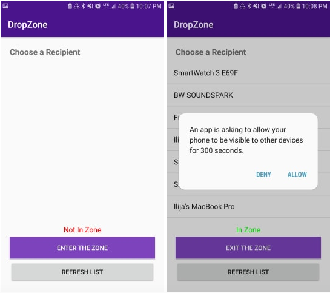
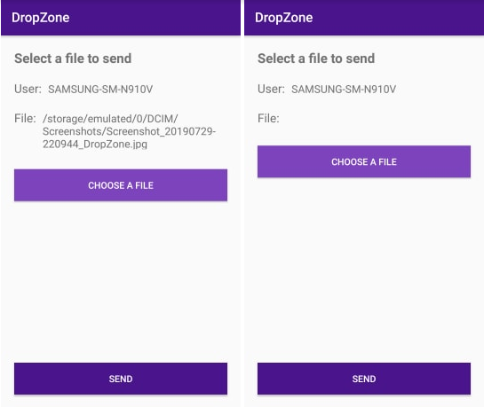
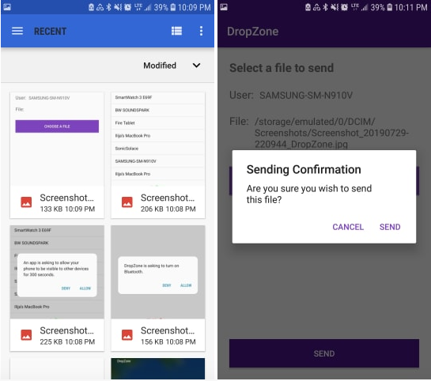

# DropZone Android Application

NOTE: THIS SOFTWARE IS DELIVERED AS-IS. I AM NOT WORKING ON THIS ANYMORE. I DO NOT TAKE ANY RESPONSIBILITY FOR ANY ISSUES THAT MAY ARISE FROM THE USAGE OF THIS SOFTWARE. USE AT YOUR OWN RISK.

---
In my software engineering course at school, we were assigned to finish a project, a software project of our choosing. Thus, DropZone was thought out, an app that tries to mimic the AirDrop feature on apple products.

It was written in Kotlin, as many resources about using Android's bluetooth library with kotlin were up to date.

---

Essentially the app works as follow
1. You open the app and enter the zone. What this means is that you have turned on bluetooth and are discoverable by other devices for some limited time.
2. You can select a device to send files to; either previously paired devices or recently discovered devices. If you are supposed to recieve a file, you don't select a device, the file should be in your file system when the sender has finished sending the file.
3. If you selected a device, you choose the file you wish to send and confirm your selection.
4. It sends the file, and a result message shows; confirming that the file sent or it failed to send.

---

There are a few things to point out that would need to be fixed if I were to keep working on this:
- I would need to figure out how to get a dialog box to open, which allows the receiving user to confirm if they want to accept the sent file for security reasons.
  - This has something to do with the communication between the UI thread and the Service threads, I need to research more on this topic
- UI could be fixed, so that it is user friendly and aesthetically pleasing

---

Things I'm proud of:
- Rapid development of this application
  - I finished this app in about 2 weeks time, starting from very little knowledge of android application development
- Learned a lot of android development
- Learned about planning larger software projects
  - UML Diagrams, Activity Diagrams, Design patterns, etc.
  
